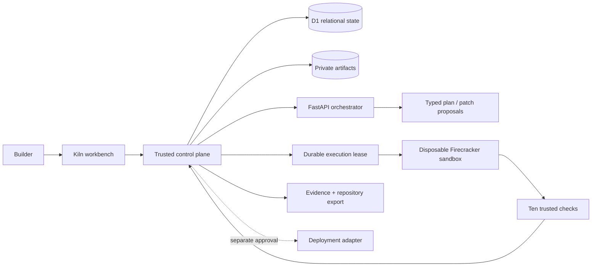

# Kiln

**A verifiable agentic app builder.** Kiln turns a plain-language product brief into an approved build contract, an explicit implementation plan, four reviewable full-stack patches, isolated verification evidence, and a complete repository export.

Kiln is deliberately narrow. It supports one maintained React + FastAPI + PostgreSQL blueprint and makes every consequential action inspectable. The result is a portfolio project about agent orchestration, secure execution, durable state, and product judgment—not a generic prompt box that claims success after emitting code.

## Why it is different

- **Two human gates before generation.** The user approves a typed contract and then the exact implementation plan.
- **Evidence is not model-authored.** Only the trusted runner can record check results or unlock a verified state.
- **Generated code is untrusted.** It never executes in the web or orchestration process.
- **Repair is constrained.** Sanitized diagnostics can drive at most three repairs, and each repair can touch only four allowlisted extension files.
- **Exports are useful.** The ZIP is a complete runnable repository with lockfiles, migrations, tests, containers, setup instructions, the approved contract, and SHA-256 provenance.
- **Failure is a first-class state.** A failed run blocks deployment, preserves structured evidence, and never borrows a green status from the seeded demo.

## What is implemented

- Responsive engineering-workbench UI with contract, preview, source, diff, architecture, timeline, evidence, export, and deployment-gate views
- Seeded completed example plus a real brief → contract → plan → generation → verification-queue journey
- App-provided sign-in, server-side tenant scoping, same-origin mutation checks, typed inputs, request limits, and rate windows
- D1-backed projects, contract revisions, runs, steps, patches, snapshots, tests, findings, artifacts, execution leases, events, and audit records
- R2-compatible private artifact storage with integrity hashes and `no-store` responses
- FastAPI orchestrator with authenticated service calls, deterministic offline planning, optional OpenAI structured planning, redaction, and strict Pydantic schemas
- Deterministic generator for exactly four contract-backed extension files:
  - `backend/app/generated_contract.py`
  - `backend/alembic/versions/0002_generated_contract.py`
  - `backend/app/api/generated_contract.py`
  - `frontend/src/generated-contract.ts`
- Durable execution queue with lease tokens, attempt limits, cancellation, signed-internal completion, and ordered SSE refresh
- Executor policy with a Vercel Sandbox/Firecracker provider and a rootless local Docker command policy
- Ten canonical checks covering frontend/backend types, lint, migrations, builds, tests, contract acceptance, preview smoke, and source policy
- Bounded diagnose → repair → reverify loop with protected evaluators, requirements, policy, tests, workflows, and lockfiles
- Complete ZIP export with per-file integrity validation and `.kiln/` contract, execution-contract, and provenance records
- CI for formatting, strict types, tests, rendered output, coverage, dependency audits, full-history secret scanning, and CodeQL; Dependabot is configured
- Architecture decisions, data-flow documentation, STRIDE threat model, abuse-case catalog, and vulnerability policy

## Architecture



The control plane owns identity, authorization, state transitions, budgets, accepted patches, and evidence persistence. The execution plane receives only generated files plus a stripped evaluator-safe contract. It receives no user session, platform token, model key, storage credential, or deployment credential.

More detail:

- [`docs/architecture/overview.md`](docs/architecture/overview.md)
- [`docs/architecture/data-flow.md`](docs/architecture/data-flow.md)
- [`docs/security/threat-model.md`](docs/security/threat-model.md)
- [`docs/security/abuse-cases.md`](docs/security/abuse-cases.md)
- [`SECURITY.md`](SECURITY.md)

## 90-second demo

1. Open the seeded Pantry Pilot and point out that it is explicitly labeled **Seeded verified example**.
2. Choose **Start another build** and keep the volunteer-scheduling brief.
3. Review the generated contract. Approve it to reveal the plan; no code changes happen before either approval.
4. Approve generation. Kiln accepts four hashed extension files and queues ten checks on the isolated runner.
5. Switch among **Code**, **Diff**, and **Architecture** to show the generated source and bounded change set.
6. Open **Evidence**. A live run begins at 0/10 and can become verified only after trusted runner output.
7. Show **Export**: JSON is available for every state, while the source ZIP includes an honest verified/unverified provenance notice.
8. Show the deployment gate. It explains destination, visibility, cost class, and required app secrets; this local build does not pretend to deploy without configured credentials.

## Local development

### Requirements

- Node.js 22.13 or later
- Python 3.12–3.14
- A local Cloudflare-compatible D1/R2 runtime, provided by the development dependencies
- Optional: Vercel credentials for hosted sandbox execution

### 1. Install and initialize

```bash
npm ci
npm run db:migrate:local
python3 -m venv .venv
.venv/bin/python -m pip install --requirement services/orchestrator/requirements.lock
.venv/bin/python -m pip install --no-deps --editable services/orchestrator
```

### 2. Start the orchestrator

Use separate long random values in real environments. Deterministic mode makes the demo reproducible without a model key.

```bash
KILN_ENV=development \
KILN_SERVICE_TOKEN=replace-with-a-long-random-service-token \
KILN_PLANNER_MODE=deterministic \
.venv/bin/uvicorn kiln_orchestrator.main:app \
  --app-dir services/orchestrator \
  --port 8100
```

### 3. Start the workbench

```bash
KILN_ORCHESTRATOR_URL=http://127.0.0.1:8100 \
KILN_SERVICE_TOKEN=replace-with-a-long-random-service-token \
KILN_EXECUTOR_SERVICE_TOKEN=replace-with-a-separate-long-random-token \
npm run dev
```

Open [http://localhost:3000](http://localhost:3000).

### 4. Optional hosted executor

The worker is intentionally separate from the web and orchestration processes. Configure the variables documented in `services/executor/.env.example`, including Vercel OIDC or a local Vercel token, then start:

```bash
npm run executor:dev
```

Without hosted credentials, generated source remains durably queued. The UI states this explicitly and does not claim isolated verification passed.

## Verification

### Platform

```bash
npm run lint
npm run typecheck
npm test
npm run test:render
npm audit --audit-level=high
```

```bash
.venv/bin/ruff check services/orchestrator
.venv/bin/ruff format --check services/orchestrator
.venv/bin/mypy services/orchestrator/kiln_orchestrator
.venv/bin/pytest services/orchestrator
```

### Generated repository

This creates a fresh volunteer-scheduling workspace and independently runs the canonical formatter, strict types, migrations, frontend/backend tests, contract acceptance, source policy, production build, and preview smoke checks:

```bash
PYTHONPATH=services/orchestrator \
.venv/bin/python scripts/evaluate_generated_workspace.py
```

## Security invariants

- Browser identity is re-authorized on every owned-resource request.
- Model output is untrusted data, schema-validated, and never used as an authorization decision.
- Patch paths are normalized; traversal, absolute paths, binaries, stale writes, protected paths, and contract expansion are rejected.
- Generated code receives no host shell, control-plane secret, provider credential, user cookie, or unrestricted network access.
- Runner commands come from a deterministic allowlist; a generated command string cannot replace them.
- Logs are size-bounded, NUL-safe, and redact bearer tokens, API keys, passwords, and connection strings before persistence.
- The repair planner receives only capped sanitized diagnostics and cannot edit evaluators, tests, policy, lockfiles, or the approved contract.
- A release state requires the full ordered set of ten passing checks; a partial prefix can only produce a failure state.
- Repository exports are rebuilt server-side from maintained blueprint files plus integrity-checked snapshots and never copy process environments.
- Deployment remains a separate human approval boundary and is unavailable for unverified runs.

## Honest scope boundary

The codebase includes the hosted Firecracker sandbox adapter, durable executor protocol, and deployment approval UX. This local workspace does **not** contain hosted Vercel credentials, so a live run queues rather than executes remotely. An external deployment adapter and rollback implementation are also not configured; the product shows the approval contract without faking a cloud resource.

The reproducible generated-workspace evaluation passes locally, but the PRD's 30-prompt reliability benchmark is still future work. Current fixtures include five versioned golden contracts. Do not turn the PRD's launch targets into résumé metrics until that benchmark exists.

## Repository map

```text
app/                                Workbench and HTTP routes
db/ + drizzle/                      Durable control-plane schema
lib/domain/                         State machine, generation, and policy
lib/server/                         Auth, store, artifacts, orchestration, export
packages/contracts/                 Shared typed trust-boundary contracts
services/orchestrator/              FastAPI planner and patch generator
services/executor/                  Isolated runner protocol and providers
blueprints/react-fastapi-postgres/  Maintained generated-app repository
scripts/                            Reproducible generated-workspace evaluation
docs/                               Architecture, ADRs, and security model
tests/                              Control-plane and executor policy tests
```

## Product contract

The phased product and security contract lives in [`outputs/kiln-product-requirements-document.md`](outputs/kiln-product-requirements-document.md).
