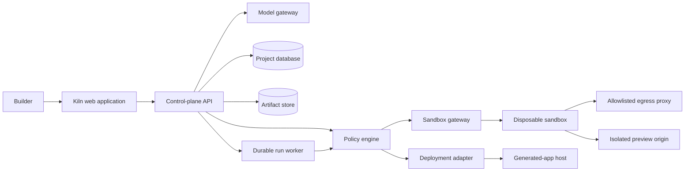
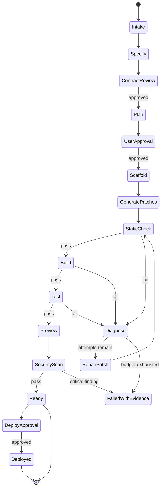

# Kiln architecture

Kiln is split into a trusted control plane and an untrusted execution plane. The browser and API may describe work, but only the policy layer can authorize it. Generated code never executes in the web process.

## System context



## Trust boundaries

1. **Browser boundary:** every client request is untrusted and re-authorized on the server.
2. **Model boundary:** model output is untrusted data parsed through typed schemas. It never grants permission.
3. **Execution boundary:** generated code runs only in a disposable sandbox with its own identity, filesystem, quota, network policy, and expiry.
4. **Preview boundary:** generated pages use a separate origin and cannot inherit Kiln cookies or access its DOM.
5. **Deployment boundary:** only a verified immutable artifact may reach the deployment adapter, and public deployment requires human approval.

## Repository layout

```text
app/                                Kiln web product and server routes
db/                                 hosted relational schema and access helper
packages/contracts/                 shared schemas and workflow vocabulary
services/orchestrator/              Python `kiln_orchestrator` service
blueprints/react-fastapi-postgres/  supported generated-app blueprint
docs/architecture/                  diagrams and boundaries
docs/security/                      threat model and abuse cases
docs/adr/                           architecture decision records
tests/                              web, authorization, and rendered-output tests
```

The web application remains at the repository root because the hosting adapter requires that layout. The boundaries are still explicit: shared contracts cannot import web or worker code, and the orchestrator cannot import presentation code.

## Run lifecycle



State transitions are deterministic application code. Model-generated actions are proposals evaluated by the policy engine.

## Initial technology choices

- Web: React, TypeScript, App Router-compatible server components, and Cloudflare-compatible ESM.
- Hosted persistence: relational D1 adapter plus object storage for snapshots and reports. Domain repositories keep the data layer portable to PostgreSQL.
- Orchestration: FastAPI, Python, Pydantic, and an explicit state machine.
- Streaming: server-sent events for ordered run updates.
- Local execution: rootless Docker with restrictive flags.
- Hosted execution: sandbox provider with a gVisor or microVM boundary.
- Generated application: React/TypeScript, FastAPI/Python, PostgreSQL, migrations, tests, and an OCI container.

## Design constraints

- One generated-app blueprint until the golden evaluation set is reliable.
- No host-shell tool available to the model.
- All writes are patch-based, path-normalized, size-limited, and revisioned.
- Repair is bounded by attempts, time, tokens, tool calls, and money.
- A run cannot report success without verification evidence.
